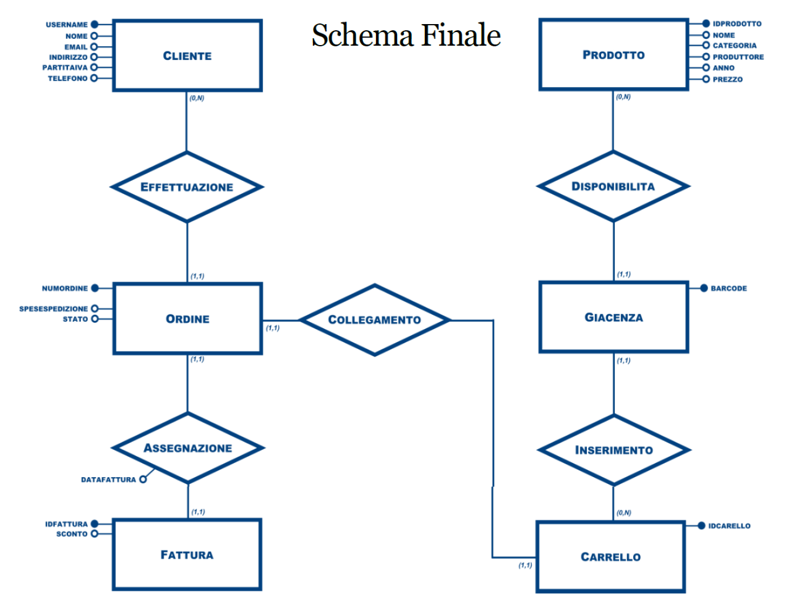

# Order Management System - Sneaker-Head

<a href="#"></a>

### Project Overview
This project implements a relational database for Sneaker-Head, a sports shoe company managing customer orders, products, carts, invoices, and inventory. The database helps streamline the ordering process and handle data efficiently for both customers and internal operations.

### Technologies Used
- **Database**: MySQL
- **Languages**: SQL for schema definition, queries, stored procedures, and triggers
- **Conceptual Model**: Entity-Relationship (ER) diagram, normalized into a relational schema


## System Design

### 1. Requirements Gathering
The database manages the following key entities and interactions:
- **Customers**: Identified by `username`, with details like name, email, address, phone number, and optional VAT number.
- **Products**: Each product has a unique `idProdotto`, including a name, category, manufacturer, production year, and price.
- **Cart**: Tracks products a customer adds to their cart, including the quantity and total cost.
- **Orders**: Associated with customers and include order details like `numOrdine`, `dataOrdine`, shipping costs, and order status.
- **Invoices**: Generated after order confirmation with information like `idFattura`, discount, and total cost.
- **Inventory**: Tracks available stock for products by a unique `barcode`.

### 2. Conceptual Design (ER Model)
The system was designed using an Entity-Relationship (ER) diagram. The main entities include:
- **Customer**, **Product**, **Cart**, **Order**, **Invoice**, **Inventory**.
- Relationships include many-to-many between products and carts, one-to-many between customers and orders, and one-to-one between orders and invoices.

### 3. Logical Design (Relational Model)
The ER model was transformed into the following relational schema, now matching the SQL structure:

#### **Tables**
- **Cliente (Customer)**:
  - `username (PK)`, `nome`, `email`, `indirizzo`, `partitaIva`, `telefono`
  
- **Prodotto (Product)**:
  - `idProdotto (PK)`, `nome`, `categoria`, `produttore`, `anno`, `prezzo`
  
- **Giacenza (Inventory)**:
  - `barcode (PK, AUTO_INCREMENT)`, `idProdotto (FK)`
  
- **Carrello (Cart)**:
  - `idCarrello (PK, AUTO_INCREMENT)`, `quantita`, `costoTotale`
  
- **Ordine (Order)**:
  - `numOrdine (PK, AUTO_INCREMENT)`, `dataOrdine`, `speseSpedizione`, `stato`, `idCarrello (FK)`
  
- **Fattura (Invoice)**:
  - `idFattura (PK, AUTO_INCREMENT)`, `sconto`, `dataFattura`, `numOrdine (FK)`
  
- **Effettuazione (Order Placement)**:
  - `numOrdine (FK)`, `username (FK)` (primary key is a composite of these two fields)
  
- **Inserimento (Cart Product Entry)**:
  - `barcode (FK)`, `idCarrello (FK)` (primary key is a composite of these two fields)

### 4. Functions, Procedures, and Triggers

- **Stored Procedure `procedure_calcola_costototale`**: This procedure calculates and updates the total cost for a given cart based on the products and quantities added.
- **Trigger `trigger_calcola_quantita`**: This trigger updates the quantity in the cart whenever a new product is added.
- **Trigger `trigger_calcola_prezzo`**: Automatically calls the `procedure_calcola_costototale` when a new order is placed, updating the cart's total cost.
- **Function `function_fatturato_per_cliente`**: Returns the number of invoices for a specific customer.

### 5. Views
- **`view_ordini_in_corso`**: A view that retrieves orders currently in progress, showing order number, date, cart quantity, total cost, shipping expenses, and customer information.

---

## ER Diagram
The following ER diagram represents the database structure:

<a href="#"></a>


## Usage

### Adding Customers
To add new customers, use the following SQL command:
```sql
INSERT INTO Cliente (username, nome, email, indirizzo, partitaIva, telefono)
VALUES ('john_doe', 'John Doe', 'john@example.com', '123 Street, City', '12345678901', '1234567890');
```

### Placing an Order
Once products are added to the cart, an order can be placed:
```sql
INSERT INTO Ordine (dataOrdine, speseSpedizione, stato, idCarrello)
VALUES ('2024-10-05', 15.00, 'in corso', 1);
```

### Generating an Invoice
After confirming an order, generate the invoice:
```sql
INSERT INTO Fattura (sconto, dataFattura, numOrdine)
VALUES (10.00, '2024-10-06', 1);
```

### Querying Available Inventory
To query the available stock for a particular product:
```sql
SELECT p.nome, g.barcode
FROM Prodotto p
JOIN Giacenza g ON p.idProdotto = g.idProdotto
WHERE p.nome = 'Air Jordan';
```

---

## Key Queries

### Find customers with VAT ending in '8':
```sql
SELECT * FROM Cliente WHERE partitaIva IS NOT NULL AND partitaIva LIKE '%8';
```

### Find products available in inventory for 'Air Jordan' models:
```sql
SELECT idProdotto FROM Prodotto WHERE nome LIKE 'Air Jordan %';
```

---

